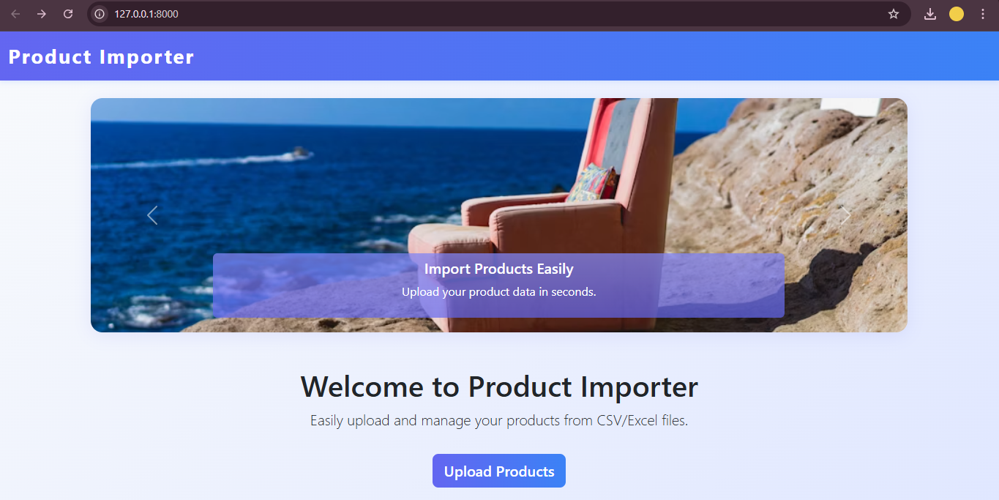
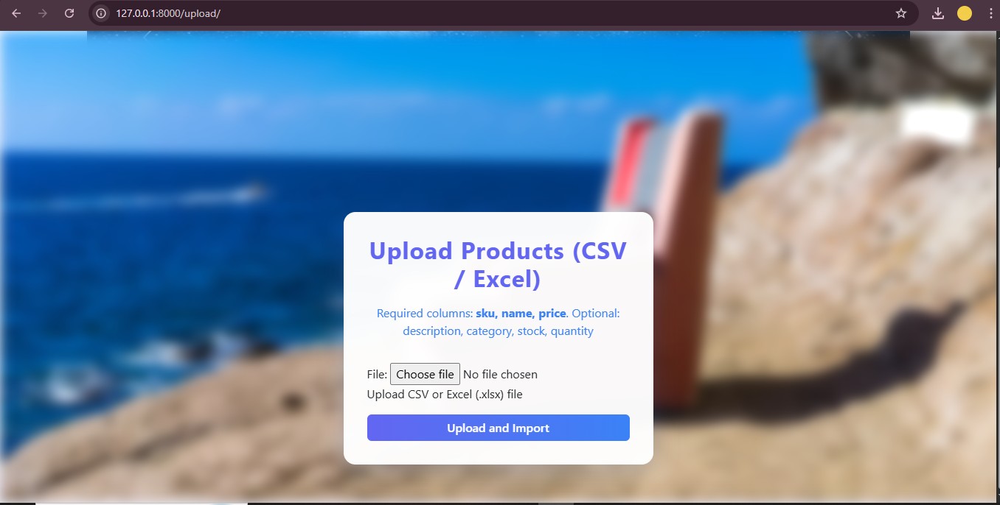
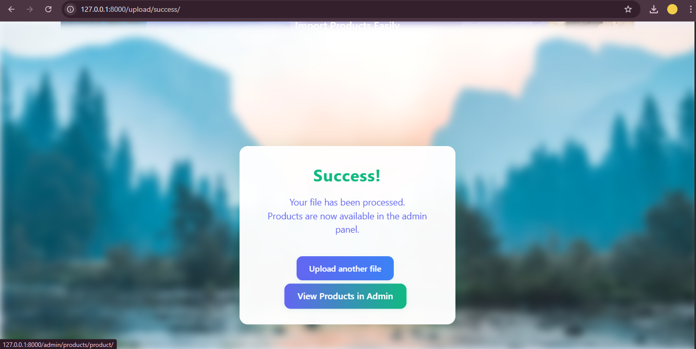
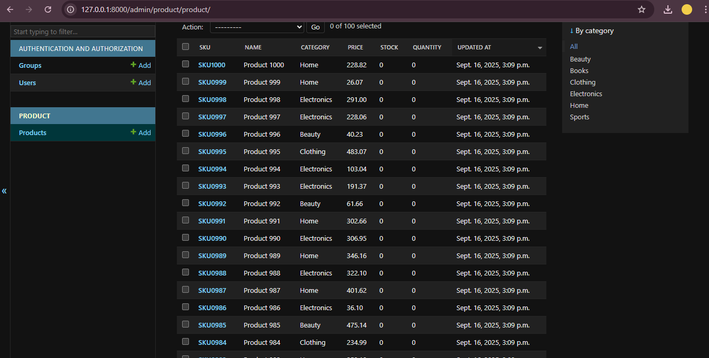
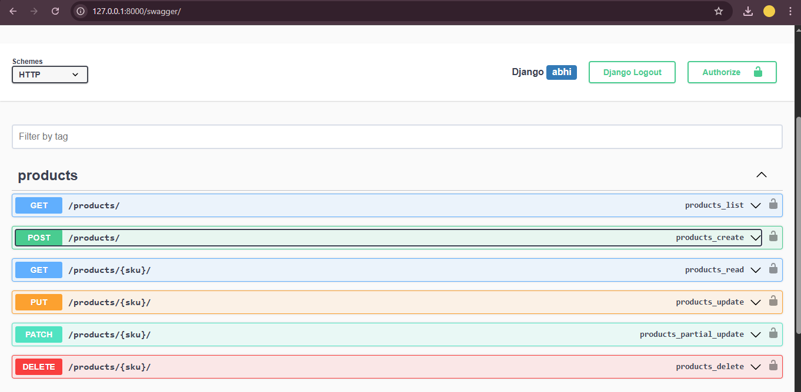
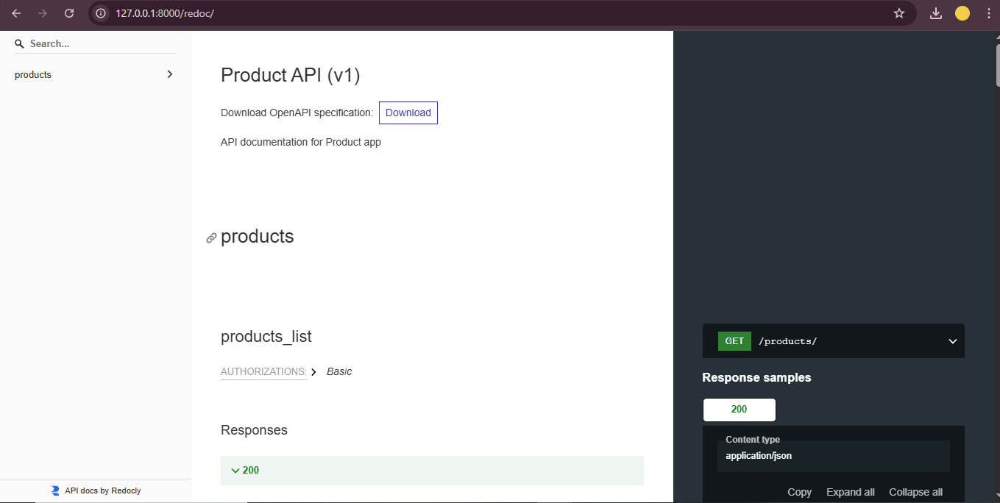
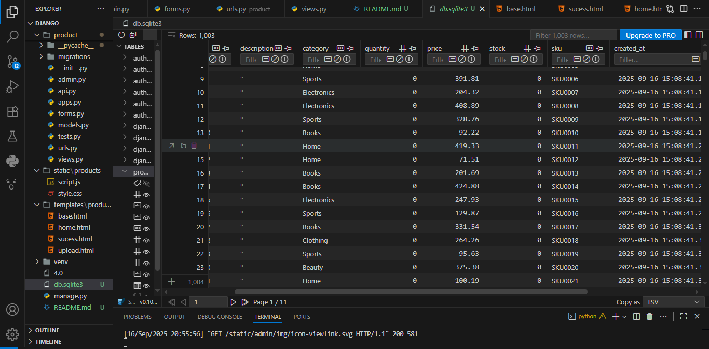

Django Product Importer

A Django-based system for uploading, parsing, and managing product data from Excel/CSV files.
Includes an interactive upload UI, robust admin management, REST API endpoints, and Swagger/Redoc documentation.

✨ Features

    📂 Upload CSV/Excel product files via a web interface

    🛠️ Parse and validate product data (required/optional columns)

    💾 Store products in SQLite (or any Django-supported DB)

    🔄 Avoid duplicate entries (by SKU — updates existing products)

    ⚙️ Django Admin interface for managing products

    🌐 REST API endpoints for CRUD operations (via Django REST Framework)

    📖 Swagger/Redoc documentation for APIs (drf-yasg)

    🎨 Attractive UI with animations, custom CSS, and background images

🖼️ Screenshots & References

🛠 Tech Stack

        Backend: Django 4.x, Python 3.8+

        Database: SQLite (default)

        Libraries: Pandas, OpenPyXL (Excel/CSV parsing)

        API: Django REST Framework (DRF)

        Docs: drf-yasg (Swagger/Redoc)

        Frontend: Bootstrap, Custom CSS/JS

🚀 Getting Started
1. Clone the Repository
    git clone <https://github.com/abhishekk1004/django>
    cd main

2. Create and Activate Virtual Environment
    python -m venv venv
    venv\Scripts\activate   # On Windows
    # OR
    source venv/bin/activate  # On Linux/Mac

3. Install Dependencies
    pip install -r requirements.txt

4. Apply Migrations
    python manage.py migrate

5. Create Superuser
    python manage.py createsuperuser

6. Run Development Server
    python manage.py runserver

Now open:

    Upload UI → http://127.0.0.1:8000/

    Django Admin → http://127.0.0.1:8000/admin/

    Swagger Docs → http://127.0.0.1:8000/swagger/

    Redoc Docs → http://127.0.0.1:8000/redoc/

📂 Product File Format
    Required Columns

        sku

        name

        price

        Optional Columns

        description

        category

        stock

        quantity

        Example CSV
        sku,name,price,description,category,stock,quantity
        1001,Product A,19.99,Desc A,Cat1,10,5
        1002,Product B,29.99,Desc B,Cat2,20,10

🌐 API Endpoints
        Method	Endpoint	Description
        GET	/api/products/	List all products
        POST	/api/products/	Create new product
        GET	/api/products/{sku}/	Retrieve single product
        PUT	/api/products/{sku}/	Update product
        DELETE	/api/products/{sku}/	Delete product

📌 Full interactive docs available at:

    Swagger → /swagger/

    Redoc → /redoc/

✅ Assumptions

        Only valid CSV/Excel files are accepted

        Duplicate SKUs are updated (not duplicated)

        Admin access is required for product management

        Example images/screenshots are provided under docs/

🤝 Contributing

        Fork this repository

        Create a feature branch: git checkout -b feature/new-feature

        Commit changes: git commit -m "feat: add new feature"

        Push branch: git push origin feature/new-feature

        Open a Pull Request 🎉

📜 License

This project is licensed under the MIT License.

## Author

**Abhishek Kushwaha**  
Email: abhishekkushwaha.np@gmail.com  
GitHub: [abhishekk1004](https://github.com/abhishekk1004)  

---
Feel free to reach out for collaboration or questions!